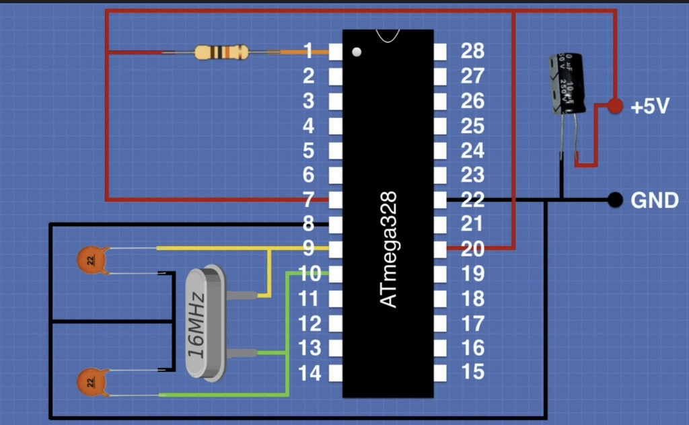

# Tetris Multi-Plataforma — Proyecto 1 DISPRO

Proyecto de **Diseño de Sistemas con Procesador (DISPRO)** que consiste en desarrollar un motor de juego de Tetris modular escrito en C, capaz de ejecutarse tanto en un computador personal (PC) como en un microcontrolador ATmega328P en modo stand-alone con matrices LED de 8×8.

## Integrantes

| Nombre                 |
|------------------------|
| Sofia Vega             |
| Juan Sanchez           |
| Andrés Felipe Trujillo |

## Descripción del Proyecto

El juego de Tetris se diseñó con alta portabilidad en mente, separando la lógica del juego de la capa de hardware (HAL). Se compila para dos plataformas distintas:

- **PC:** Versión en consola usando caracteres ASCII.
- **Sistema Embebido:** ATmega328P controlando dos matrices LED 8×8 mediante registros de desplazamiento 74HC595.

## Estructura del Repositorio

```
Proyecto1_Dispro/
│
├── README.md
│
├── Hito1/                              # Hito 1 - Control de Matriz y Driver 74HC595
│   ├── Paper/
│   │   └── TetrisMultiplataform_Hito1.pdf
│   ├── SisComputador/
│   │   └── CodigoHito1PC.c             # Versión PC: imagen estática en consola
│   └── SisEmbebido/
│       └── CodigoHito1SE.ino           # Versión embebida: imagen estática en matrices LED
│
├── Hito2/                              # Hito 2 - Animación y Gestión de Entradas
│   └── SisComputador/
│       └── CodifoHito2PC.c             # Versión PC: animación con pieza T y controles
│
└── Hito3/                              # Hito 3 - Sistema Tetris Completo
    ├── SIsEmbebido3/                   # Versión embebida previa (Arduino UNO)
    │   └── src/
    │       ├── app/
    │       ├── drivers/
    │       ├── tetris/
    │       └── ui/
    │
    └── SistemaFinal/                   # Versión unificada multi-plataforma
        ├── main.c                      # Punto de entrada y bucle principal
        ├── tetris_logic.h              # Tipos de datos y prototipos de lógica
        ├── tetris_logic.c              # Lógica pura del Tetris (sin hardware)
        ├── hal_display.h               # Interfaz HAL (abstracción de hardware)
        ├── driver_pc.c                 # Implementación HAL para consola Windows
        └── driver_avr.c               # Implementación HAL para ATmega328P
```

## Hitos del Proyecto

### Hito 1 — Control de Matriz y Driver 74HC595
- Mostrar una imagen estática (corazón y cara feliz) en las dos matrices LED 16×8.
- Mostrar la misma figura en consola con caracteres ASCII.
- Implementar el driver de bajo nivel para el 74HC595.

### Hito 2 — Animación y Gestión de Entradas
- Animación de una pieza T con caída automática y controles de teclado (A/D/W/S/Q).
- Lectura de 4 teclas en el sistema embebido directamente desde los registros PINx.
- Uso de Timer para la base de tiempo de la animación y debounce en botones.

### Hito 3 — Sistema Tetris Completo (SistemaFinal)
- Arquitectura modular con capa de abstracción de hardware (HAL) que permite compilar el mismo código fuente para PC y ATmega328P.
- Lógica completa del Tetris: generación aleatoria de 7 piezas, colisiones, rotaciones, eliminación de líneas, puntaje y niveles progresivos.
- Código unificado con directivas `#ifdef PLATFORM_AVR` y `#ifdef PLATFORM_PC` en `hal_display.h`.
- ATmega328P en modo stand-alone con cristal externo de 16 MHz, controlando dos matrices LED 8×8 mediante 74HC595 en cascada y 4 botones con antirebote por software.
- Pantalla de Game Over en las matrices LED mostrando piezas colocadas (matriz superior) y puntaje (matriz inferior) con dígitos de 3×5 píxeles.
- Puntaje basado en piezas colocadas: cada 10 piezas suma 10 puntos.

## Diagrama de Conexiones del ATmega328P



El circuito base incluye:
- **Pin 1 (RESET):** Resistencia de 10kΩ a +5V (pull-up).
- **Pin 7 (VCC)** y **Pin 20 (AVCC):** Conectados a +5V.
- **Pin 8 (GND)** y **Pin 22 (GND):** Conectados a GND.
- **Pin 9 (XTAL1)** y **Pin 10 (XTAL2):** Cristal de 16 MHz con dos capacitores de 22pF a GND.
- **Capacitor de desacoplo:** 10µF (o 0.1µF cerámico) entre +5V y GND, cerca del chip.

### Botones (Puerto D — entrada con pull-up externo a +5V)

| Pin ATmega328P | Puerto | Función       |
|----------------|--------|---------------|
| Pin 4          | PD2    | Botón ROTAR   |
| Pin 5          | PD3    | Botón IZQUIERDA |
| Pin 6          | PD4    | Botón BAJAR   |
| Pin 11         | PD5    | Botón DERECHA |

> El otro lado de cada botón va a +5V.

### 74HC595 — Control de Matrices LED

| Pin ATmega328P | Puerto | Señal 74HC595         |
|----------------|--------|-----------------------|
| Pin 12         | PD6    | DATA (SER / DS)       |
| Pin 13         | PD7    | RESET (SRCLR / MR)    |
| Pin 14         | PB0    | CLOCK (SRCLK / SH_CP) |
| Pin 15         | PB1    | LATCH (RCLK / ST_CP)  |
| Pin 16         | PB2    | OE (Output Enable)    |

## Tecnologías y Herramientas

- **Lenguaje:** C (ANSI C)
- **PC:** Compilado con GCC (MinGW en Windows)
- **Embebido:** ATmega328P stand-alone (16 MHz, cristal externo)
- **Programador:** Arduino UNO como ISP (ArduinoISP)
- **Toolchain AVR:** avr-gcc, avr-objcopy, avrdude
- **Hardware:** Matrices LED 8×8, registros de desplazamiento 74HC595, 4 botones

## Cómo Compilar

### Versión PC (Hito 1)
```bash
gcc CodigoHito1PC.c -o Tetris1.exe
```

### Versión PC (Hito 2)
```bash
gcc CodifoHito2PC.c -o Tetris2.exe
```

### Versión PC (Hito 3 — SistemaFinal)

Asegurarse de que en `hal_display.h` esté activo `PLATFORM_PC`:
```c
#define PLATFORM_PC
//#define PLATFORM_AVR
```

Compilar desde la carpeta `Hito3/SistemaFinal/`:
```bash
gcc -o tetris.exe main.c tetris_logic.c driver_pc.c
```

Ejecutar:
```bash
./tetris.exe
```

### Versión Embebida (Hito 3 — SistemaFinal para ATmega328P)

Asegurarse de que en `hal_display.h` esté activo `PLATFORM_AVR`:
```c
//#define PLATFORM_PC
#define PLATFORM_AVR
```

**1. Compilar y generar el archivo .hex** desde la carpeta `Hito3/SistemaFinal/`:
```bash
avr-gcc -mmcu=atmega328p -DF_CPU=16000000UL -Os -o tetris.elf main.c tetris_logic.c driver_avr.c
avr-objcopy -O ihex tetris.elf tetris.hex
```

**2. Configurar los fusibles** del ATmega328P (solo se hace una vez):
```bash
avrdude -c stk500v1 -p m328p -P <PUERTO> -b 19200 -U lfuse:w:0xFF:m -U hfuse:w:0xDE:m -U efuse:w:0xFD:m
```

**3. Cargar el programa** en el microcontrolador:
```bash
avrdude -c stk500v1 -p m328p -P <PUERTO> -b 19200 -U flash:w:tetris.hex
```

> **Nota:** Reemplazar `<PUERTO>` por el puerto serial correspondiente.
> - **Mac:** `/dev/cu.usbmodemXXXXX` (buscar con `ls /dev/cu.usbmodem*`)
> - **Windows:** `COMX` (verificar en el Administrador de Dispositivos)
>
> El Arduino UNO debe tener cargado el sketch **ArduinoISP** y estar conectado al ATmega328P según la siguiente tabla:
>
> | Arduino UNO | ATmega328P (DIP-28)       |
> |-------------|---------------------------|
> | Pin 13 (SCK)  | Pin 19 (PB5 / SCK)     |
> | Pin 12 (MISO) | Pin 18 (PB4 / MISO)    |
> | Pin 11 (MOSI) | Pin 17 (PB3 / MOSI)    |
> | Pin 10         | Pin 1  (RESET)          |
> | 5V             | Pin 7 (VCC) y Pin 20 (AVCC) |
> | GND            | Pin 8 (GND) y Pin 22 (GND)  |
